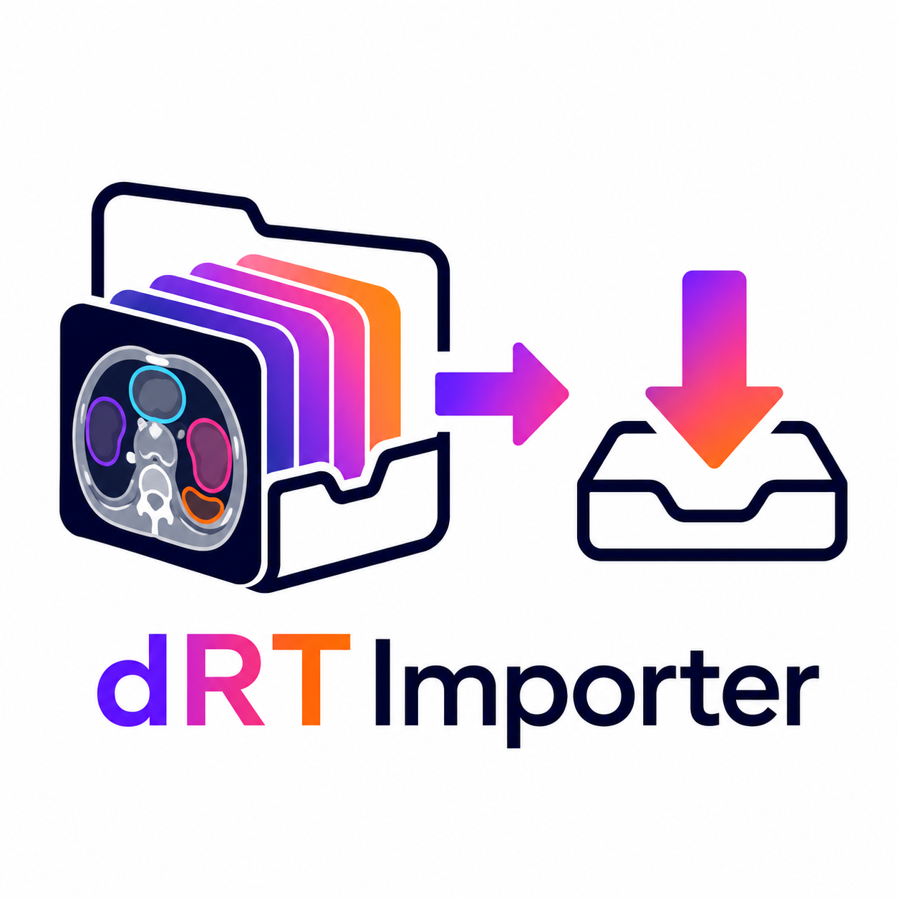

# dRTImporter

<p align="center">
  
</p>

| **Author** | **Project** |
|:----------:|:-----------:|
| [**Daniele Dall'Olio**](https://github.com/DanieleDallOlio) | dRTImporter |

**dRTImporter** is a dedicated DICOM import plugin for **3D Slicer** that
recognizes **MiM-style dynamic RT Structure Sets** and loads them as
time-resolved **segmentation sequences**.

The plugin intentionally ignores ordinary static RT Structure Sets. Static
RTSTRUCT import remains the responsibility of
[SlicerRT](https://github.com/SlicerRt/SlicerRT).

> [!IMPORTANT]
> A time-varying RT Structure Set is not a standardized DICOM object model.
> dRTImporter implements the convention observed in MiM output, in which
> `Referenced Frame Number (0008,1160)` in each contour image reference is
> used as a one-based temporal frame number.

---

## Scope

dRTImporter has one responsibility:

- import supported dynamic RT Structure Sets as Slicer segmentation sequences.

It does **not**:

- replace SlicerRT's static RTSTRUCT importer;
- import an RTSTRUCT that does not satisfy the dynamic detection rules;
- export DICOM from the DICOM module;
- perform motion correction or kinetic analysis.

---

## Dynamic RTSTRUCT detection

Detection is deliberately strict to avoid claiming a normal static RTSTRUCT
that references several spatial frames of an enhanced image.

An RT Structure Set is offered by dRTImporter only when all the following are
true:

1. `Modality (0008,0060)` is `RTSTRUCT`.
2. The SOP Class is RT Structure Set Storage.
3. At least two contours contain `Referenced Frame Number (0008,1160)`.
4. Referenced frame numbers form a consecutive one-based sequence: `1..N`.
5. Every frame number maps to exactly one referenced SOP Instance UID.
6. Every referenced SOP Instance UID maps to exactly one frame number.

The last two checks distinguish the supported temporal convention from the
standard static use of `Referenced Frame Number`, where several spatial frames
may belong to the same multi-frame SOP Instance.

If these requirements are not satisfied, the plugin returns no loadable and
does not import anything.

---

## Import workflow

For each temporal frame, dRTImporter:

1. selects the contours carrying that one-based frame number;
2. creates a temporary conventional static RTSTRUCT;
3. asks SlicerRT to convert it into a segmentation node;
4. stores a deep copy in a `vtkMRMLSequenceNode`;
5. assigns the corresponding index from a compatible volume sequence;
6. creates or updates a `vtkMRMLSequenceBrowserNode`.

If the referenced PET DICOM series is unavailable, contour reconstruction is
still possible because `Contour Data (3006,0050)` stores patient-space
coordinates. Automatic synchronization then follows conservative rules:

- an exact referenced Series Instance UID match is preferred;
- otherwise, the only scalar-volume sequence with exactly the same frame count
  is used;
- if the match is ambiguous, a standalone segmentation browser is created.

---

## Requirements

- 3D Slicer
- SlicerRT
- Slicer's Sequences and Segmentations modules
- pydicom in Slicer's Python environment

The standalone export helper additionally requires
[`rt-utils`](https://github.com/qurit/rt-utils):

```python
slicer.util.pip_install("rt-utils")
```

Restart Slicer after installing Python dependencies.

---

## Installation

### Extension build

Clone the repository and configure it as a normal Slicer extension:

```bash
git clone https://github.com/DanieleDallOlio/dRTImporter.git
mkdir dRTImporter-build
cd dRTImporter-build
cmake \
  -DSlicer_DIR=/path/to/Slicer-build \
  ../dRTImporter
cmake --build . --config Release
```

Install or enable **SlicerRT** in the same Slicer installation.

### Development without packaging

For rapid testing, add the inner scripted-module directory to Slicer's module
paths:

```text
dRTImporter/dRTImporter
```

Restart Slicer so the DICOM plugin is registered.

---

## Usage

1. Install SlicerRT and dRTImporter.
2. Import the dynamic RTSTRUCT into Slicer's DICOM database.
3. If available, load the corresponding dynamic PET sequence first.
4. In the DICOM loadables list, select:

   ```text
   ... - dynamic RTSTRUCT (N frames)
   ```

5. If SlicerRT also offers the same object as a normal static RTSTRUCT,
   deselect that static loadable when only the dynamic sequence is wanted.
6. Load the selected dRTImporter entry.
7. Navigate the segmentation using the synchronized Sequence Browser.

The import may take time because every temporal state is converted separately.
A progress dialog reports the current frame and allows cancellation.

---

## Output

The importer creates:

- a `vtkMRMLSequenceNode` containing segmentation snapshots;
- a segmentation proxy node;
- a `vtkMRMLSequenceBrowserNode`, unless a compatible existing browser is
  reused.

The following attributes are stored for downstream use:

```text
dRTImporter.DynamicRTStruct
dRTImporter.Convention
dRTImporter.SourceFile
dRTImporter.FrameToSOPInstanceUID
dRTImporter.ReferencedSeriesInstanceUID
dRTImporter.FrameNumber
```

---

## Repository structure

```text
dRTImporter/
├── CMakeLists.txt
├── dRTImporter.png          
├── LICENSE
├── README.md
└── dRTImporter/
    ├── CMakeLists.txt
    ├── dRTImporter.py
    └── dRTImporterPlugin.py
```

---

## Limitations

- The temporal RTSTRUCT convention is vendor-specific and is not a standard
  DICOM representation of time-varying segmentations.
- Import uses `(0008,1160)` as a temporal index only after the strict
  one-to-one detection rules succeed.
- Missing referenced PET files prevent exact source-image validation but do not
  remove the patient-space contour coordinates from the RTSTRUCT.
- SlicerRT is required for contour-to-segmentation conversion.
- The export helper currently expects one distinct Enhanced PET DICOM object
  per temporal frame.
- Import and export must be validated against representative MiM datasets
  before clinical or production use.

---

## DICOM references

- [DICOM Image Reference Macro](https://dicom.nema.org/medical/dicom/current/output/chtml/part03/sect_c.18.4.html)
- [DICOM ROI Contour Module](https://dicom.nema.org/medical/dicom/current/output/chtml/part03/sect_c.8.8.6.html)
- [DICOM Structure Set Module](https://dicom.nema.org/medical/dicom/current/output/chtml/part03/sect_c.8.8.5.html)

---

## Status

dRTImporter is research software under active development. It is not a medical
device and must be independently validated for each intended workflow.

---

## License

dRTImporter is distributed under the **MIT License**. See [LICENSE](LICENSE).

---

## Author

**Daniele Dall'Olio**  
University of Bologna

- [GitHub](https://github.com/DanieleDallOlio)
- [University profile](https://www.unibo.it/sitoweb/daniele.dallolio)

---

## Acknowledgments

dRTImporter is developed for the 3D Slicer ecosystem and relies on the DICOM,
Sequences, Segmentations, and SlicerRT infrastructure maintained by their
respective contributors.
